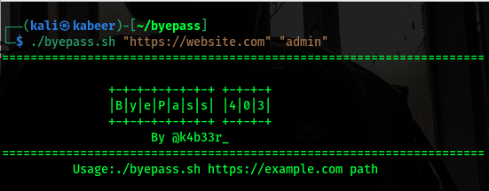

# byepass
-A simple bash script made to check for 403 bypasses with the help of curl commands
-It can be used to check if there's a 200 OK status code in one of the provided payloads 
-

# Usage
`./byepass.sh "https://website.tld" "path"`

# Features
- Use of multiple known Bypasses for 403 with the help of curl

# Installation
   * `git clone https://github.com/kab33r/byepass.git`
   * `cd byepass`
   * `chmod +x byepass.sh`

   
